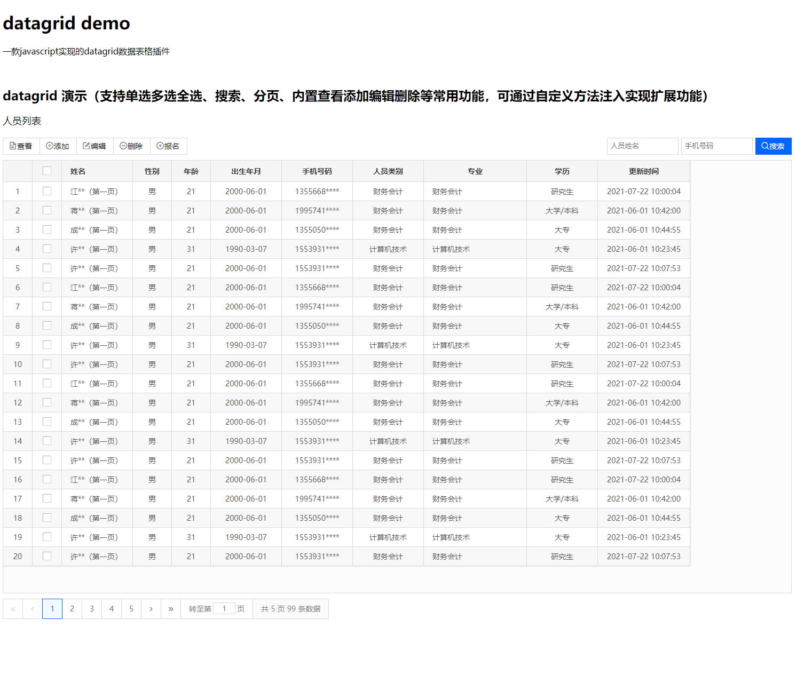

# datagrid

一款javascript实现的datagrid数据表格插件

## 说在前面

数据呈现一直是web端和各类应用系统必不可少的一环，几乎所有的软件都离不开数据呈现，哪怕开发的应用不是基于数据库。

普通的table数据呈现已经足够使用了，只是绝大部分情况下需要自行扩展额外的功能，比如查看行、新增行等功能。所以市面上出现了一大堆用于二维数据表格呈现的插件，比如jQuery的datatable，easyui的datagrid等等。

在基于实际项目和上述插件的使用过程中，一直想独立开发一款原生javascript实现的数据表格插件，主要原因有以下几点：
1. 纯javascript实现，不依赖于任何第三方框架，灵活可控。
2. 框架在不断地推陈出新。从prototype的没落，到jQuery的下滑，再到现在广为流行的Vue，以后也一样是淘汰的命运，但是只要web在，javascript原生依然在。
3. javascript已成为现代乃至未来不可或缺的技术，熟练掌握原生写法就特别重要了，比如现在众多开发者只会Vue不会原生，职业发展将非常不利。
4. 每一个开发者都应该有自己的一套组件系统，哪怕是使用第三方的，还是自己开发的。当然本人推荐有能力的开发者都自行开发，有时候重复造轮子是对技术熟练掌握的必经之路。
5. 还有其他很多原因。

## 插件介绍

该插件命名为datagrid，是一款类似于easyui的web数据表格插件，但是该插件不依赖于其他库和框架。

该插件主要用于web端的数据表格呈现，通过设置url参数，将服务器返回的数据自动渲染到页面上。插件实现了标题栏、工具栏、搜索栏、数据列表和分页条集成，您只要配置相关参数，该插件可以帮你自动在页面指定的元素上创建，无需在额外手工规划布局。

该插件支持众多的参数配置，比如是否开启分页、是否显示行号、行号是否连续、单选多选全选、是否设置工具操作和搜索条等。插件内置了查看、新增、编辑、删除和搜索等5种通用操作，您可以通过回调方法实现额外需求。同时插件还预留了methods参数用于扩展额外的操作方法。

该插件由一个js和一个css文件组成，css样式文件在实际项目中可用于调整为自己的样式。


## 插件演示


## 演示地址

[funsent datagrid](http://www.9k4k.com/datagrid/tests/demo.html)


## 插件特点
- 标题自定义
- 支持配置请求url、请求方法和默认请求参数
- 支持主键字段配置，通过该字段唯一标记一行，对应数据库的主键字段
- 支持列字段自定义配置
- 支持单选多选全选，及关联选择行功能
- 支持分页，需本人另一个插件：pagination，需传入当前页码page和每页显示记录数pagesize等2个参数
- 支持自动行号，以及行号是否连续
- 支持自定义工具按钮和操作，内置了查看、新增、编辑、删除等4个通用操作
- 支持隔行显示背景色
- 支持双击查看行功能
- 支持自定义搜索，表单类型支持：text（普通文本框）、select（下拉选择框）和button（搜索按钮）
- 支持自定义方法扩展注入，通过methods参数
- 独立的css样式文件可以自行调整显示样式


## 插件使用

1. 下载插件
```shell
# git clone https://gitee.com/funsent/datagrid.git
```

2. 创建页面，同时引入插件及相关文件，参数配置和初始化
```html
<!DOCTYPE html>
<html lang="en">
    <head>
        <!-- 可选 -->
        <link rel="stylesheet" href="../src/hippo/iconfont.css">
        <script src="js/jquery.min.js"></script>
        <script src="js/layer/layer.js"></script>

        <!-- 必要 -->
        <link rel="stylesheet" href="../src/pagination/css/pagination.css">
        <script src="../src/pagination/pagination.js"></script>
        <link rel="stylesheet" href="../src/css/datagrid.css">
        <script src="../src/datagrid.js"></script>
    </head>
    <body>

        <!-- datagrid容器 -->
        <div class="container"></div>

        <script>
       // 查看：对话框打开后的回调
        const lookOpenCallback = function (form, record) {
            console.log('查看：对话框打开后的回调');
        };

        // 添加：对话框打开后的回调
        const addOpenCallback = function (form) {
            console.log('添加：对话框打开后的回调');
        };

        // 添加：请求前的回调
        const addBeforeCallback = function (form) {
            console.log('添加：请求前的回调');
        };

        // 编辑：对话框打开后的回调
        const editOpenCallback = function (form, record) {
            console.log('编辑：对话框打开后的回调');
        };

        // 编辑：请求前的回调
        const editBeforeCallback = function (form, record, formData) {
            console.log('编辑：请求前的回调');
        };

        // 扩展方法，用于注入到datagrid，供toolbar操作调用
        const checkinHandler = function (instance, params) {
            console.log('扩展方法，用于注入到datagrid，供toolbar操作调用');
        };

        // 搜索后的回调
        const searchCallback = function (form, records, params) {
            console.log('搜索后的回调');
            console.log(params.name); // 输出：ok
        };

        let rootUrl = '/';

        // 初始化datagrid
        funsent.datagrid.init('.container', {
            title: '人员列表', // 标题参数，可选
            url: 'http://www.9k4k.com/datagrid/tests/getPersons.php', // url参数用于请求数据源
            primary_field: 'id', // 主键名称，必要参数
            query_params: {}, // url参数设置时，请求服务器时携带的额外参数
            method: 'get', // 默认请求方法
            dblclick_look: true, // 双击显示行数据
            pagination: true, // 是否分页
            page: 1, // 当前页码
            pagesize: 20, // 每页显示记录数
            show_rownumber: true, // 是否显示行号
            keep_rownumber: true, // 显示的行号是否在翻页时保持连续
            single_select: false, // 是否单选模式
            check_onselect: true, // 选择行时是否选中主键的checkbox
            select_oncheck: true, // 选中主键的checkbox时是否选择行
            striped: true, // 隔行显示颜色
            methods: { // 外部方法注入参数，用于扩展自己需要的功能，其参数有两个：instance和params
                checkin: checkinHandler
            },
            columns: [ // 数据列
                { field: 'id', title: '', width: '40px', halign: 'center', align: 'center', checkbox: true },
                { field: 'realname', title: '姓名', width: '100px', halign: 'left', align: 'left' },
                { field: 'gender', title: '性别', width: '40px', halign: 'center', align: 'center' },
                { field: 'age', title: '年龄', width: '40px', halign: 'center', align: 'center' },
                { field: 'birth', title: '出生年月', width: '100px', halign: 'center', align: 'center' },
                { field: 'mobile', title: '手机号码', width: '100px', halign: 'center', align: 'center' },
                { field: 'type_id', title: '人员类别', width: '100px', halign: 'center', align: 'center' },
                { field: 'major', title: '专业', width: '160px', halign: 'center', align: 'left' },
                { field: 'education_id', title: '学历', width: '100px', halign: 'center', align: 'center' },
                { field: 'update_time', title: '更新时间', width: '140px', halign: 'center', align: 'center' }
            ],
            toolbar: [ // 操作按钮（工具按钮），内置了查看look、添加add、编辑edit、删除delete等4中操作，如果需要额外操作按钮，可自行扩展（通过methods参数注入，或直接写在这里，如下面的报名操作）
                { form: '.form-look', text: '查看', icon_cls: 'iconfont icon-file', handler: 'look', url: '', params: { opened_callback: lookOpenCallback } },
                { form: '.form-add', text: '添加', icon_cls: 'iconfont icon-add-circle', handler: 'add', url: rootUrl + 'add_person', params: { before_callback: addBeforeCallback, opened_callback: addOpenCallback } },
                { form: '.form-edit', text: '编辑', icon_cls: 'iconfont icon-edit', handler: 'edit', url: rootUrl + 'edit_person', params: { before_callback: editBeforeCallback, opened_callback: editOpenCallback } },
                { form: '.form-delete', text: '删除', icon_cls: 'iconfont icon-minus-circle', handler: 'delete', url: rootUrl + 'delete_person', params: { message: '确定删除吗？' } },
                { form: '.form-checkin', text: '报名', icon_cls: 'iconfont icon-add-circle', handler: 'checkin', url: rootUrl + 'checkin_need', params: { title: '报名项目', width: '970px', height: '680px' } }
            ],
            searchbar: [ // 搜索条，类型有三种：select下拉选择框、text文本输入框和button搜索按钮，其中button类型只用于搜索按钮，且始终在最后呈现
                { type: 'text', width: '120px', field: 'realname', placeholder: '人员姓名', autocomplete: false },
                { type: 'text', width: '120px', field: 'mobile', placeholder: '手机号码', autocomplete: false },
                { type: 'button', text: '搜索', icon_cls: 'iconfont icon-search', params: { callback: searchCallback, name:'ok' } }
            ]
        });
        </script>
    </body>
</html>
```

## 注意事项

1. 目前还未彻底移除jQuery和layer，主要使用了jQuery的ajax相关方法和弹出层，未来将自行开发ajax和弹出层，并将移除对jQuery和layer的依赖
2. 插件文档待更新

## 意见建议

联系方式 QQ: 2018708，微信：younggf

> 加好友时请备注：datagrid插件